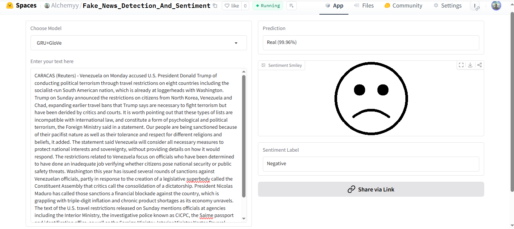

# 📰 Fake News Detection & Sentiment Analysis  

This project provides a model for **Fake News Detection** combined with **Sentiment Analysis** (Positive, Negative, Neutral) using advanced Natural Language Processing (NLP) techniques.  

---

## 🚀 Demo  
Try the live demo on Hugging Face Spaces:  
👉 [Fake News Detection & Sentiment Analysis - Demo](https://huggingface.co/spaces/Alchemyy/Fake_News_Detection_And_Sentiment)  

---

## 📊 Example Output  
The following image demonstrates how the output looks after processing a sample text:  

